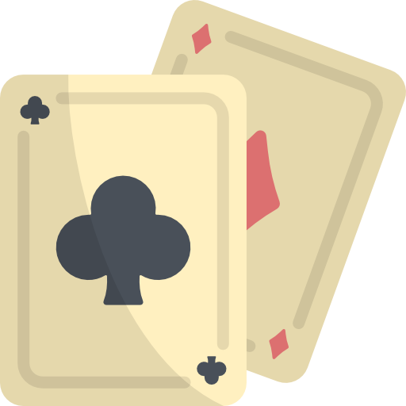

# Poker (C#)

## About
This is a poker game made in a C# console application.

The player is given a $1,000 bankroll, and can wager up to all of their money on each play.

The player is dealt five cards and has the option of switching some cards. Once their final selection is made, the hand is evaluated.
- If the player contains a winning hand, the payout value of the hand is multiplied by their wager.
- If the player contains a losing hand, their wager is lost.

This continues until the player quits or until they go bankrupt.

## Context
This application was made as my final project for Programming II in Winter 2020.

We were given a .exe of the teacher's Poker game and were tasked with recreating it.

The only code provided to us were the Card and Deck classes, which we had to figure out a way to use while trying to emulate Claudiu's application. The methods and the logic were up to each student to code.

This served as a good final test for our introduction to OOP. After initially thinking I couldn't pull it off, I have good memories of working on this while slowly figuring it out more and more. Completing this project made me believe there was a legitimate chance I could be successful in this field.

## How to run the app
1. Open the project in Visual Studio.
2. Click Run
3. Select whether you would like to play the game, or test the app first.
    - Testing the game involves pre-selecting a winning hand and making a successful wager.

4. The player will be dealt a hand and will be offered the chance to change up to a maximum of 4 cards.
5. Once they continue, the hand will be evaluated and the player will either:
    - Win, and their wager will be multiplied by a constant representing the value of either a Pair, Two Pair, Three of a Kind, Straight, Flush, Full House, Fourt of a Kind, Straight Flush, or Royal Flush.
    - Lose, and their wager will remain lost from their bank.

6. This continues until either the player chooses to quit or until they run out of money.

